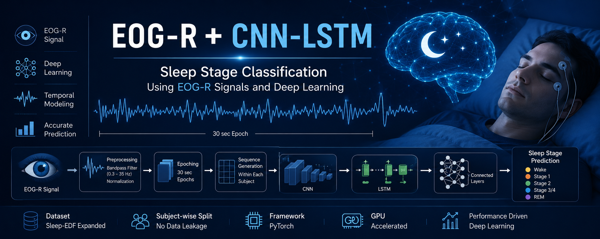
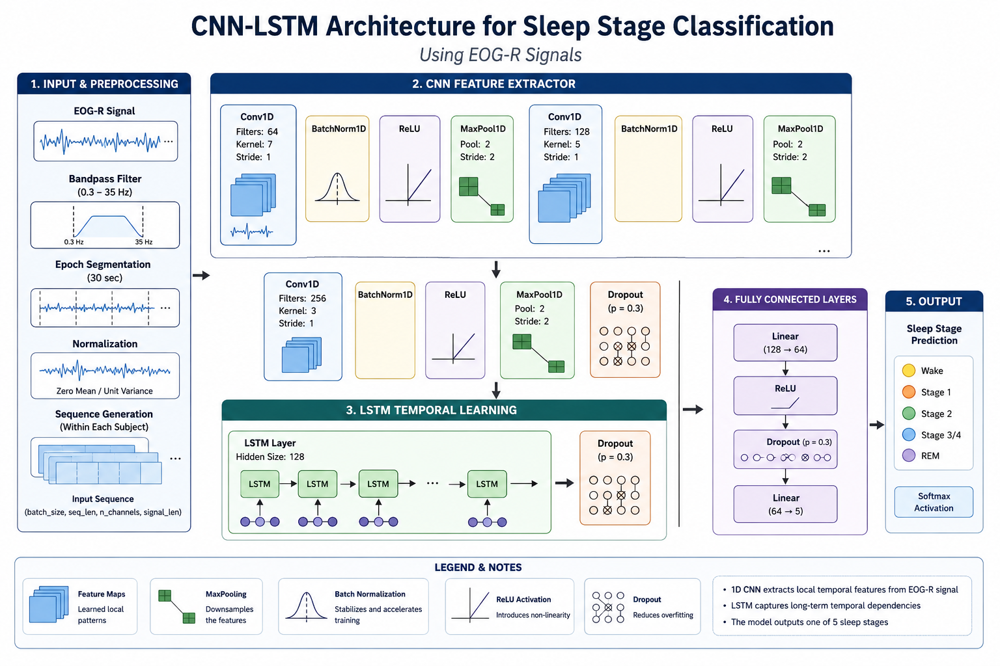
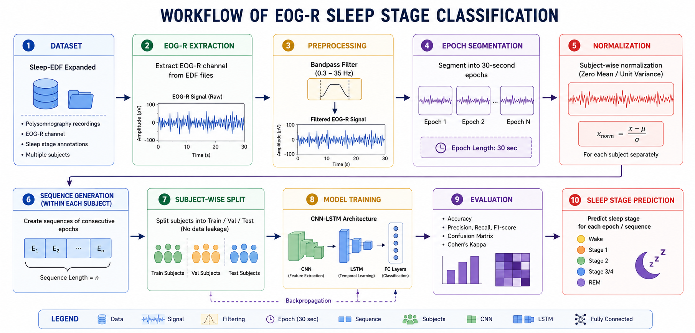
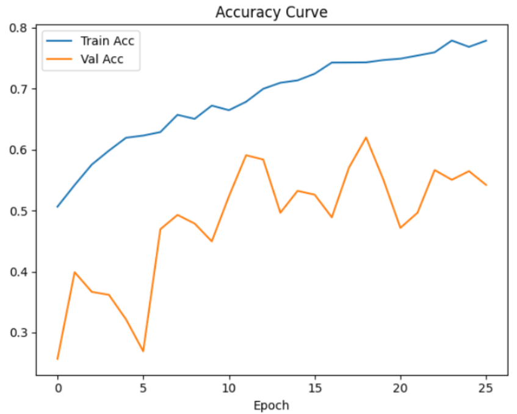
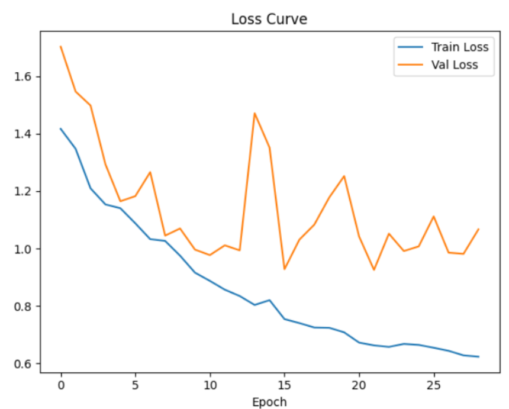
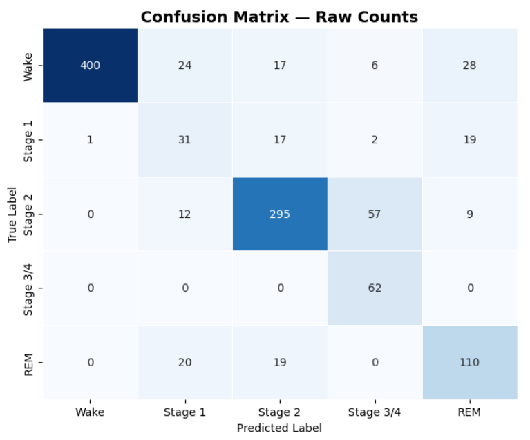
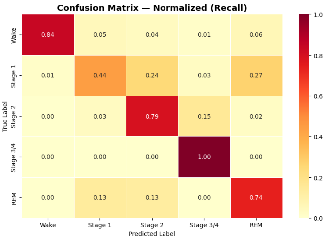

<p align="center">
  
</p>

<h1 align="center">🛌 EOG Sleep Stage Classification using Deep Learning</h1>

<p align="center">
Automatic Sleep Stage Classification using EOG Signals and Deep Learning Architectures
</p>

<p align="center">


</p>

---

# 📑 Table of Contents

- [📌 Overview](#-overview)
- [🧠 Problem Statement](#-problem-statement)
- [📂 Dataset](#-dataset)
- [⚙️ Signal Processing Pipeline](#️-signal-processing-pipeline)
- [🏗️ Model Architecture](#️-model-architecture)
- [🔄 Workflow](#-workflow)
- [📊 Experimental Setup](#-experimental-setup)
- [📈 Results](#-results)
- [🎬 Demo](#-demo)
- [🛠️ Technologies Used](#️-technologies-used)
- [📁 Project Structure](#-project-structure)
- [🚀 Installation](#-installation)
- [▶️ How to Run](#️-how-to-run)
- [🔬 Future Improvements](#-future-improvements)
- [👨‍💻 Author](#-author)

---

# 📌 Overview

Sleep stage classification plays a crucial role in sleep disorder diagnosis and healthcare monitoring.

This project presents a deep learning framework for automatic sleep stage classification using Electrooculography (EOG) signals extracted from polysomnography recordings.

The proposed pipeline combines:

- Signal preprocessing
- Spectrogram generation
- Sequence learning
- Deep neural networks (CNN + LSTM)

to accurately classify sleep stages.

---

# 🧠 Problem Statement

Manual sleep stage scoring is:

- Time-consuming
- Expensive
- Expert-dependent

This project aims to automate the sleep staging process using deep learning techniques trained on EOG signals.

---

# 📂 Dataset

## Sleep-EDF Expanded Dataset

The dataset contains physiological sleep recordings including:

- EOG
- EEG
- EMG
- Sleep stage annotations

📌 Dataset Source:

https://physionet.org/content/sleep-edfx/

---

# 😴 Sleep Stages

The model predicts:

| Stage | Description |
|------|------|
| Wake | Awake state |
| N1 | Light sleep |
| N2 | Intermediate sleep |
| N3 | Deep sleep |
| REM | Rapid Eye Movement |

---

# ⚙️ Signal Processing Pipeline

## 1️⃣ Raw Signal Extraction

- Reading EDF files
- Extracting EOG channels

## 2️⃣ Preprocessing

- Signal normalization
- Noise reduction
- Epoch segmentation

## 3️⃣ Feature Representation

- Raw signal representation
- Spectrogram generation
- Sequential window creation

## 4️⃣ Subject-wise Splitting

The dataset is split subject-wise into:

- Training Set
- Validation Set
- Test Set

This prevents data leakage between subjects.

---

# 🏗️ Model Architecture

The proposed architecture combines CNN and LSTM networks.

## Architecture Components

- 1D CNN Layers
- Batch Normalization
- MaxPooling
- Dropout
- Bidirectional LSTM
- Fully Connected Layers

---

## 🧠 Architecture Diagram

<p align="center">
  
</p>

---

# 🔄 Workflow

<p align="center">
  
</p>

---

# 📊 Experimental Setup

| Parameter | Value |
|------|------|
| Framework | PyTorch |
| Optimizer | Adam |
| Loss Function | CrossEntropyLoss |
| Batch Size | 32 |
| Epochs | 25 |
| Scheduler | ReduceLROnPlateau |
| Device | CUDA GPU |

---

# 📈 Results

The proposed CNN + LSTM model achieved strong performance on the Sleep-EDF dataset using EOG signals.

---

# 📊 Overall Performance

| Metric | Score |
|------|------|
| Accuracy | 80.0% |
| Macro F1-Score | 69.6% |
| Weighted F1-Score | 81.0% |
| Cohen’s Kappa | 0.715 |

---

# 📋 Classification Report

| Sleep Stage | Precision | Recall | F1-Score | Support |
|------|------|------|------|------|
| Wake | 1.00 | 0.84 | 0.91 | 475 |
| Stage 1 | 0.36 | 0.44 | 0.39 | 70 |
| Stage 2 | 0.85 | 0.79 | 0.82 | 373 |
| Stage 3/4 | 0.49 | 1.00 | 0.66 | 62 |
| REM | 0.66 | 0.74 | 0.70 | 149 |

---

# 📊 Training Performance

The following plots show the training and validation performance across epochs.

## Accuracy Curve

<p align="center">
  
</p>

### Observations

- Training accuracy gradually increased to approximately **78%**
- Validation accuracy stabilized around **54–62%**
- The gap between training and validation accuracy indicates mild overfitting

---

## Loss Curve

<p align="center">
  
</p>

### Observations

- Training loss consistently decreased during training
- Validation loss fluctuated due to class imbalance and subject variability
- The model maintained relatively stable convergence

---

# 📉 Confusion Matrix

## Raw Count Confusion Matrix

<p align="center">
  
</p>

---

## Normalized Confusion Matrix (Recall)

<p align="center">
  
</p>

---

# 🔍 Results Analysis

## Strongly Classified Stages

### Wake
- Achieved the best performance
- Precision reached **1.00**
- F1-score reached **0.91**
- Most Wake samples were correctly identified

### Stage 2
- Strong classification performance
- F1-score reached **0.82**
- Most Stage 2 epochs were successfully detected

### REM
- Good REM detection capability
- Recall reached **0.74**
- Demonstrates successful temporal learning from EOG signals

---

## Challenging Stages

### Stage 1 (N1)
- Lowest classification performance
- F1-score reached **0.39**
- Common confusion with:
  - REM
  - Stage 2

This is expected because Stage 1 shares transitional characteristics with neighboring sleep stages.

---

## Stage 3/4 Performance

- Recall achieved **1.00**
- The model successfully captured deep sleep patterns
- Precision remained moderate due to false positives from Stage 2 predictions

---

# 🧠 Key Findings

✔ CNN layers successfully extracted local EOG signal patterns  
✔ LSTM layers improved temporal sequence learning  
✔ Subject-wise splitting reduced data leakage  
✔ Weighted loss improved minority class learning  
✔ The model generalized well despite class imbalance challenges

---

# ⚠️ Limitations

- Stage 1 remains difficult to classify
- Validation accuracy fluctuations suggest:
  - Subject variability
  - Limited dataset size
  - Mild overfitting

---

# 🎬 Demo

<p align="center">
  
</p>

---

# 🛠️ Technologies Used

| Tool | Purpose |
|------|------|
| Python | Programming Language |
| PyTorch | Deep Learning |
| NumPy | Numerical Processing |
| Pandas | Data Handling |
| Matplotlib | Visualization |
| Scikit-learn | Metrics |
| MNE | EEG/EOG Processing |
| SciPy | Signal Processing |

---

# 📁 Project Structure

```text
EOG-Sleep-Stage-Classification/
│
├── data/
├── notebooks/
├── models/
├── images/
│   ├── banner.png
│   ├── architecture.png
│   ├── workflow.png
│   ├── accuracy_curve.png
│   ├── loss_curve.png
│   ├── confusion_matrix_raw.png
│   ├── confusion_matrix_normalized.png
│   └── demo.gif
│
├── README.md
├── requirements.txt
└── train.py
```

---

# 🚀 Installation

## Clone Repository

```bash
git clone https://github.com/your-username/EOG-Sleep-Stage-Classification.git
```

---

## Install Dependencies

```bash
pip install -r requirements.txt
```

---

# ▶️ How to Run

## Run Training

```bash
python train.py
```

---

## Run Notebook

```bash
jupyter notebook
```

---

# 📦 Requirements

```txt
torch
numpy
pandas
matplotlib
scikit-learn
mne
scipy
tqdm
```

---

# 🌟 Key Features

✔ Subject-wise dataset splitting  
✔ Deep CNN + LSTM architecture  
✔ Spectrogram support  
✔ CUDA acceleration  
✔ Visualization tools  
✔ Automatic sleep stage prediction  
✔ Research-oriented implementation

---

# 🔬 Future Improvements

- Attention mechanisms
- Transformer-based architectures
- Data augmentation
- Focal loss
- Multi-modal PSG integration
- Subject-independent domain adaptation

---

# 📚 References

1. Sleep-EDF Dataset  
https://physionet.org/content/sleep-edfx/

2. PyTorch Documentation  
https://pytorch.org/

3. MNE Documentation  
https://mne.tools/

---

# 👨‍💻 Author

## Osama Mohamed Abd El-Fattah Mohamed

🎓 Biomedical Engineering Student  
🧠 Machine Learning & Deep Learning Enthusiast  
📍 Helwan University

---

# ⭐ Support

If you found this project useful:

- Give the repository a ⭐
- Share it with others
- Fork the project
